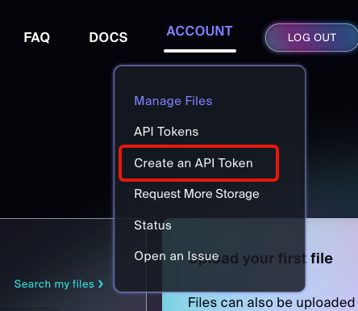

# Frontend development

## Clone sources

```bash
git clone https://github.com/hackdays-io/mint-rally.git
```

## Install dependencies

```bash
yarn install
```

## Create .env.local

```bash
cp .env.local.sample .env.local
vi .env.local
```

Please update below three valuables.

If you have told these values already, please specify them.

| Key                                   | Value                                                                                                                                 |
| ------------------------------------- | ------------------------------------------------------------------------------------------------------------------------------------- |
| NEXT_PUBLIC_WEB3_STORAGE_KEY          | A storage key that obtained by the Next Step                                                                                          |
| NEXT_PUBLIC_CONTRACT_EVENT_MANAGER    | A event manager contract address created by [localnode.md](localnode.md)                                                              |
| NEXT_PUBLIC_CONTRACT_MINT_NFT_MANAGER | A mint NFT manager contract address created by [localnode.md](localnode.md)                                                           |
| NEXT_PUBLIC_PROVIDER_RPC              | A RPC URI of contract. ex. https://rpc-mumbai.maticvigil.com/v1/....  use `http://localhost:8545/` if you use local chain enrironment |
| NEXT_PUBLIC_CHAIN_ID                  | An ID of the chain that serves the minting contract. use 31337 if you use local chain enriromnent.                                    |

## Create web3 storage and key

Go to [web3 storage](https://web3.storage/) and create an account.

Create an account



Create API key


Copy API key


## Start server

```bash
yarn dev
```

You will see the website at `http://localhost:3000/`